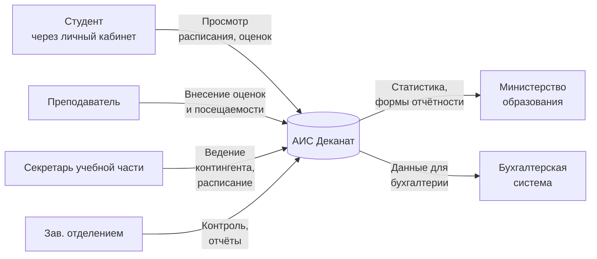
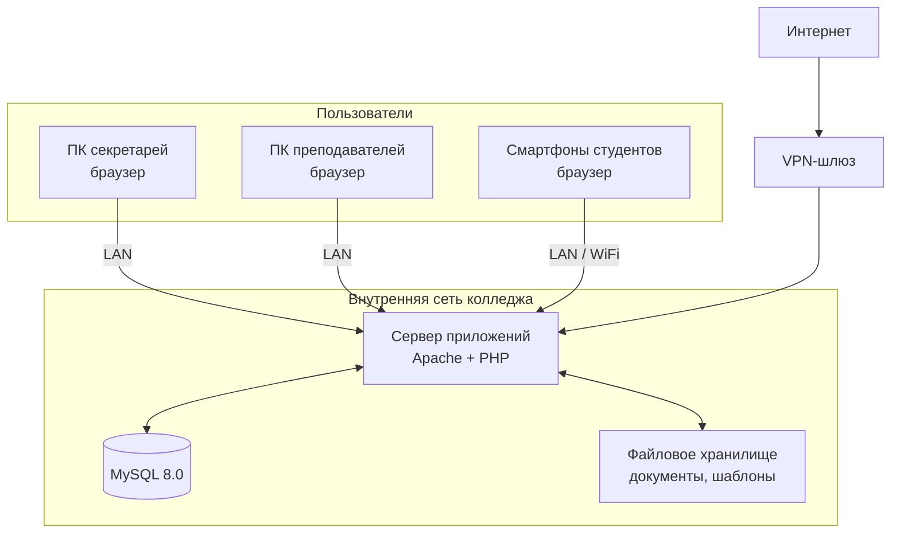
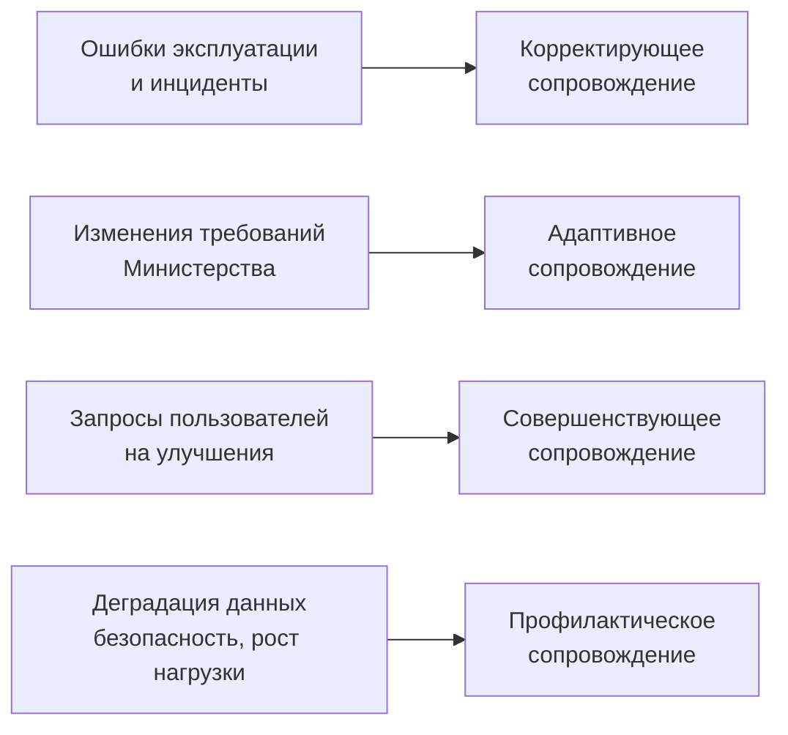

# Практика

> Внимание! Все схемы в примере являются схематичными, требуется учитывать нотации при создании отчёта.

## Этап 1. Характеристика сопровождаемой информационной системы

---

# Что требуется выполнить в данном разделе

В рамках Этапа 1 студент обязан:

1. Выбрать конкретную информационную систему, которая находится в эксплуатации (реальную или смоделированную).
2. Описать назначение системы в условиях эксплуатации: какие функции выполняет, какие данные обрабатывает.
3. Определить категории пользователей системы и их зависимость от её работоспособности.
4. Охарактеризовать эксплуатационную среду: тип системы, техническую инфраструктуру, режим работы, критичность отказов.
5. Сформулировать факторы, обуславливающие необходимость сопровождения данной системы.
6. Построить схему взаимодействия системы со средой эксплуатации.
7. Сделать вывод: что именно сопровождается и почему это требует постоянной поддержки.

Объём раздела должен быть достаточным для определения ролей службы поддержки и SLA в Этапе 2.

---

# Важно

Приведённое ниже описание АИС «Деканат» Педагогического колледжа является **примером выполнения характеристики сопровождаемой системы**.

Данный пример:

* демонстрирует структуру изложения и уровень детализации;
* показывает, как связывать пользователей, зависимость от системы и критичность отказов;
* содержит схемы в формате Mermaid.

Студент обязан:

* выбрать собственную информационную систему (в соответствии с темой практики);
* выполнить описание по аналогичной структуре;
* построить собственные схемы (не копировать приведённый пример).

---

## Объект сопровождения: АИС «Деканат» Педагогического колледжа

**Организация:** государственное бюджетное профессиональное образовательное учреждение «Педагогический колледж № 5» (далее — Колледж).

**Система:** Автоматизированная информационная система «Деканат» (далее — АИС) — web-приложение, развёрнутое на собственном сервере учреждения.

**Цель раздела:** описать систему как объект сопровождения — что сопровождается, кто зависит от системы, в каких условиях она работает и почему требует постоянной поддержки.

---

## 1.1. Назначение системы в эксплуатации

### 1.1.1. Общая характеристика

АИС «Деканат» обеспечивает автоматизацию учебно-организационной деятельности колледжа. В системе ежедневно выполняются следующие операции:

* **Учёт контингента** — ведение личных дел студентов, учёт зачисления, отчисления, перевода, восстановления.
* **Управление расписанием** — формирование и актуализация расписания занятий и экзаменов по группам, преподавателям и аудиториям.
* **Фиксация посещаемости** — отметки о явке/неявке студентов в разрезе занятий.
* **Учёт успеваемости** — внесение и хранение оценок по промежуточной и итоговой аттестации.
* **Формирование отчётности** — сводные ведомости успеваемости, журналы, статистика для предоставления в министерство.
* **Управление справочниками** — специальности, группы, предметы, преподаватели, аудитории.

**Ключевые обрабатываемые данные:**

| Тип данных | Примеры |
|------------|---------|
| Данные студентов | ФИО, дата рождения, группа, специальность, статус |
| Учебные данные | Предметы, учебные планы, нагрузка преподавателей |
| Оперативные данные | Расписание, посещаемость, оценки, задолженности |
| Отчётные данные | Ведомости, приказы, статистические формы |

### 1.1.2. Схема взаимодействия системы со средой

///caption
Рисунок 1 – Схема взаимодействия АИС «Деканат» со средой эксплуатации
///

**Пояснение к рисунку 1:**

* система является центральной точкой обработки учебно-организационной информации;
* входные потоки — от преподавателей, секретарей и администрации;
* выходные потоки — отчётность во внешние органы и данные для смежных систем;
* студенты имеют доступ к просмотру данных (расписание, оценки) через личный кабинет.

---

## 1.2. Категории пользователей и их зависимость от системы

### 1.2.1. Описание категорий

| Категория пользователей | Количество | Характер работы с АИС | Степень зависимости |
|-------------------------|:----------:|----------------------|:-------------------:|
| **Секретари учебной части** | 3 | Ежедневная работа: ведение контингента, расписание, приказы, отчёты | Критическая |
| **Преподаватели** | 45 | Ежедневное внесение посещаемости и оценок; просмотр расписания | Высокая |
| **Заведующие отделениями** | 4 | Контроль успеваемости и посещаемости, формирование отчётов | Высокая |
| **Студенты** | 850 | Просмотр расписания, оценок, задолженностей | Средняя |
| **Заместитель директора** | 1 | Просмотр сводной аналитики; контроль выполнения учебного плана | Средняя |
| **Системный администратор** | 1 | Техническое обслуживание, управление доступами, резервное копирование | Высокая |

### 1.2.2. Анализ зависимости по категориям

**Секретари учебной части** — наиболее зависимая категория. При недоступности системы секретарь не может:

* оформить приказ о зачислении или отчислении;
* сформировать ведомость для сессии;
* актуализировать расписание.

Ручная альтернатива возможна, но крайне трудозатратна и исключает параллельную работу нескольких секретарей.

**Преподаватели** — при недоступности системы не могут вносить оценки и посещаемость. Задержка более 1–2 дней приводит к накоплению «долга» по вводу данных и ошибкам в ведомостях.

**Студенты** — могут получить информацию альтернативно (объявления, мессенджер), поэтому зависимость средняя. Критична только в период сессии — при просмотре результатов.

---

## 1.3. Эксплуатационная среда

### 1.3.1. Технические характеристики

| Параметр | Значение |
|----------|---------|
| Тип системы | Web-приложение (PHP + MySQL) |
| Интерфейс пользователя | Браузер (Chrome, Firefox, Edge) |
| Сервер приложений | Собственный сервер колледжа (Linux, Apache) |
| База данных | MySQL 8.0 |
| Файловое хранилище | Локальное (на сервере приложений) |
| Сеть | Внутренняя сеть колледжа (LAN) + VPN для удалённого доступа |
| Количество одновременных пользователей | До 60 в рабочее время |
| Режим работы | 07:30–20:00 в рабочие дни; периодический доступ в выходные |
| Интеграции | Выгрузка в Excel; передача форм в министерство образования вручную |

### 1.3.2. Схема эксплуатационной среды

///caption
Рисунок 2 – Схема эксплуатационной среды АИС «Деканат»
///

**Пояснение к рисунку 2:**

* все компоненты системы (сервер, БД, хранилище) размещены на одном физическом сервере — это создаёт единую точку отказа;
* пользователи внутри учреждения работают через локальную сеть; преподаватели могут подключаться удалённо через VPN;
* отсутствует облачная избыточность, что увеличивает риск простоя при аппаратных сбоях.

### 1.3.3. Критичность отказов

| Ситуация | Последствия | Допустимое время простоя |
|----------|-------------|:------------------------:|
| Отказ сервера в рабочее время | Полная остановка работы секретарей и преподавателей | До 2 часов |
| Недоступность в период сессии | Невозможность оформить ведомости; срыв аттестации | До 30 минут |
| Потеря данных за период | Восстановление из резервной копии с потерей данных за период | Потеря не более 24 часов |
| Ошибки в данных успеваемости | Неверные ведомости; конфликты с приказами | Устранение за 1 рабочий день |

---

## 1.4. Факторы, обуславливающие необходимость сопровождения

### 1.4.1. Перечень факторов

| Фактор | Описание | Вид сопровождения |
|--------|----------|:-----------------:|
| **Ошибки эксплуатации** | Пользователи допускают ошибки ввода; периодически возникают конфликты при параллельном редактировании | Корректирующее |
| **Изменения нормативных требований** | Министерство меняет формы отчётности и порядок ведения документации ежегодно | Адаптивное |
| **Запросы на доработку функционала** | Преподаватели и администрация запрашивают новые фильтры, форматы выгрузок, удобства интерфейса | Совершенствующее |
| **Рост объёма данных** | За 5 лет в БД накопился архив; производительность запросов снижается | Профилактическое |
| **Безопасность и доступы** | Смена персонала требует регулярного обновления учётных записей; уязвимости требуют обновления ПО | Профилактическое |
| **Резервное копирование** | Без регулярных копий потеря данных при сбое сервера необратима | Вспомогательный процесс |
| **Консультации пользователей** | Новые сотрудники и преподаватели нуждаются в обучении работе с системой | Совершенствующее |

### 1.4.2. Связь факторов с видами сопровождения

///caption
Рисунок 3 – Связь факторов с видами сопровождения АИС «Деканат»
///

---

## 1.5. Вывод по этапу 1

По итогам характеристики АИС «Деканат» зафиксировано:

1. **Объект сопровождения** — web-приложение, обеспечивающее учёт контингента, успеваемости, расписания и формирование отчётности Педагогического колледжа № 5.

2. **Зависимость пользователей** — секретари учебной части зависят критически (без системы ключевые задачи невыполнимы); преподаватели и администрация — высокая зависимость.

3. **Эксплуатационная среда** — web-приложение на собственном сервере; все компоненты на одной машине (единая точка отказа); до 60 одновременных пользователей; режим работы 07:30–20:00.

4. **Критичность отказов** — допустимый простой в рабочее время не более 2 часов; в период сессии — не более 30 минут.

5. **Факторы сопровождения** — ошибки эксплуатации, ежегодные изменения нормативных требований, запросы на доработку, рост объёма данных, требования безопасности, необходимость резервного копирования.

Эти данные являются **основой для Этапа 2**: критичность отказов и категории пользователей определяют, какие роли необходимы в службе сопровождения и каким должен быть регламент реагирования.
