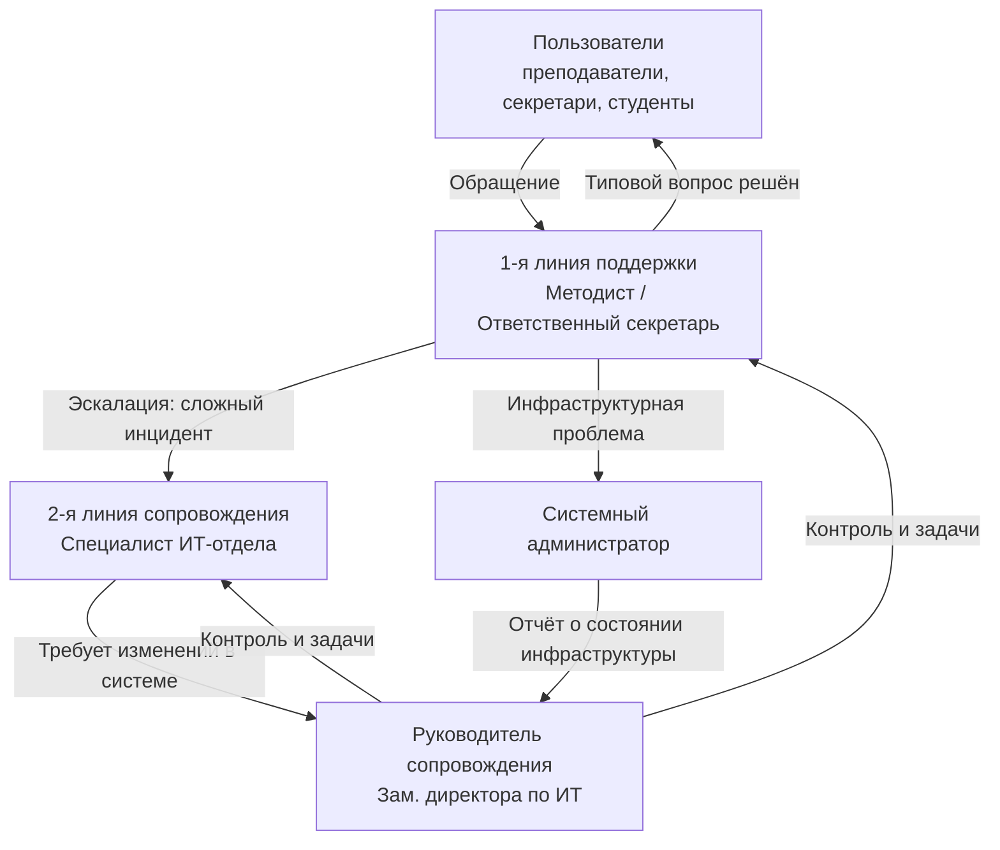
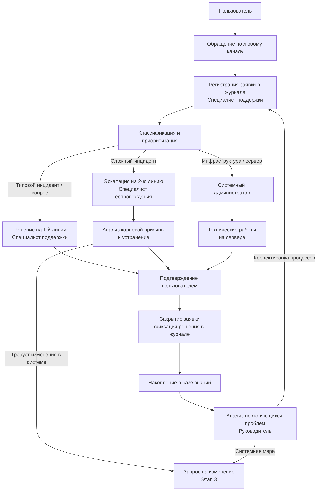

# Практика

> Внимание! Все схемы в примере являются схематичными, требуется учитывать нотации при создании отчёта.

## Этап 2. Организация службы сопровождения: роли, процессы и регламент

---

# Что требуется выполнить в данном разделе

В рамках Этапа 2 студент обязан:

1. Определить роли участников сопровождения и их функции.
2. Составить матрицу ответственности (RACI) по основным процессам.
3. Классифицировать и описать процессы сопровождения (основные, вспомогательные, управляющие).
4. Перечислить каналы поступления обращений и обосновать необходимость единой точки регистрации.
5. Установить регламент реагирования (SLA) на основании критичности отказов из Этапа 1.
6. Построить схему взаимосвязи процессов сопровождения.

---

# Важно

Приведённый пример основан на АИС «Деканат» из Этапа 1. Студент обязан выполнить аналогичную работу для своей системы и организации, **не копируя** данный пример.

---

## 2.1. Роли и ответственности в сопровождении АИС «Деканат»

### 2.1.1. Состав службы сопровождения

В условиях Педагогического колледжа служба сопровождения не является отдельным подразделением — её функции распределены между сотрудниками ИТ-отдела и специалистами по методической поддержке.

| Роль | Кто выполняет в колледже | Функции в сопровождении АИС |
|------|--------------------------|------------------------------|
| **Пользователь** | Преподаватели, секретари, студенты | Сообщает о проблеме; предоставляет описание симптомов; подтверждает решение |
| **Специалист поддержки (1-я линия)** | Методист / ответственный секретарь учебной части | Регистрирует обращения; консультирует по типовым вопросам; выполняет сброс паролей и типовые операции |
| **Специалист сопровождения (2-я линия)** | Специалист ИТ-отдела (1 человек) | Анализирует и устраняет сложные инциденты; реализует изменения; тестирует обновления |
| **Системный администратор** | Системный администратор ИТ-отдела | Обслуживает сервер; выполняет резервное копирование; управляет доступами; восстанавливает систему при сбое |
| **Руководитель сопровождения** | Заместитель директора по ИТ | Контролирует сроки обработки обращений; анализирует повторяющиеся проблемы; согласует изменения; формирует отчётность |

### 2.1.2. Схема службы сопровождения

///caption
Рисунок 1 – Структура службы сопровождения АИС «Деканат»
///

### 2.1.3. Матрица ответственности (RACI)

| Процесс | Пользователь | Специалист поддержки | Специалист сопровождения | Системный администратор | Руководитель |
|---------|:---:|:---:|:---:|:---:|:---:|
| Регистрация обращения | C | R/A | I | I | I |
| Решение типового инцидента | I | R/A | C | I | I |
| Эскалация и анализ сложного инцидента | I | R | R/A | C | I |
| Инфраструктурные работы (сервер, сеть) | I | I | C | R/A | I |
| Управление изменением в системе | I | I | R | C | A |
| Резервное копирование | I | I | I | R/A | I |
| Восстановление данных после сбоя | I | I | C | R | A |
| Контроль SLA и отчётность | I | I | C | C | R/A |

---

## 2.2. Классификация и состав процессов сопровождения

### 2.2.1. Основные процессы

| Процесс | Входы | Выходы | Ответственный |
|---------|-------|--------|:-------------:|
| Регистрация обращения пользователя | Устное или письменное сообщение | Зарегистрированная заявка с приоритетом | Специалист поддержки |
| Обработка инцидента | Заявка, журнал ошибок системы | Устранённый инцидент или эскалация | Специалист сопровождения |
| Сброс пароля / разблокировка | Заявка пользователя | Восстановленный доступ | Специалист поддержки |
| Установка обновления системы | Пакет обновлений, план релиза | Обновлённая версия АИС | Специалист сопровождения + Администратор |
| Восстановление после сбоя | Резервная копия, протокол инцидента | Восстановленная система и данные | Системный администратор |

### 2.2.2. Вспомогательные процессы

| Процесс | Входы | Выходы | Ответственный |
|---------|-------|--------|:-------------:|
| Резервное копирование БД | База данных MySQL | Резервная копия + журнал копирования | Системный администратор |
| Консультация пользователей | Вопрос пользователя | Ответ / инструкция | Специалист поддержки |
| Тестирование изменений | Разработанное изменение, тест-кейсы | Протокол тестирования | Специалист сопровождения |
| Актуализация инструкций | Изменения в АИС | Обновлённое руководство пользователя | Специалист сопровождения |
| Управление учётными записями | Приказы о приёме/увольнении | Актуальные права доступа в системе | Системный администратор |

### 2.2.3. Управляющие процессы

| Процесс | Входы | Выходы | Ответственный |
|---------|-------|--------|:-------------:|
| Контроль SLA | Журнал заявок | Отчёт по соблюдению сроков | Руководитель |
| Анализ повторяющихся проблем | База инцидентов | Выявленные паттерны, рекомендации | Руководитель |
| Планирование обновлений | Список запросов на изменение | План-график релизов | Руководитель |
| Отчётность о доступности | Данные мониторинга | Ежемесячный отчёт об Uptime | Руководитель |

---

## 2.3. Каналы поступления обращений

В Педагогическом колледже пользователи обращаются к специалисту поддержки следующими способами:

| Канал | Кто использует | Способ регистрации |
|-------|---------------|-------------------|
| Устное обращение | Преподаватели и секретари (в здании) | Специалист поддержки заводит заявку в журнале вручную |
| Мессенджер (Telegram-группа) | Преподаватели | Специалист фиксирует в журнале заявок |
| Электронная почта | Секретари, администрация | Переносится в журнал заявок; переписка сохраняется |
| Телефонный звонок | Преподаватели (в нерабочее время) | Фиксируется при следующем рабочем времени |

> **Важно.** Вне зависимости от канала обращения **все заявки вносятся в единый журнал учёта** (таблица Excel на общем диске). Это позволяет контролировать сроки и накапливать данные для анализа инцидентов.

> **Проблема текущей организации.** Использование Excel-таблицы вместо специализированного helpdesk-инструмента — фактор риска: нет автоматического контроля SLA, нет статусов заявок в реальном времени. Это будет учтено в предложениях по совершенствованию (Этап 4).

---

## 2.4. Регламент реагирования (SLA)

SLA разработан на основании критичности отказов, определённой в Этапе 1 (допустимый простой в рабочее время — до 2 часов; в период сессии — до 30 минут).

### 2.4.1. Классификация обращений

| Тип обращения | Признак | Примеры для АИС «Деканат» |
|---------------|---------|--------------------------|
| **Критический** | Система полностью недоступна; затронуты все пользователи | Отказ сервера; недоступность БД |
| **Высокий** | Ключевая функция недоступна; затронута значительная группа | Невозможность сохранить ведомость в период сессии |
| **Средний** | Отдельная функция нарушена; есть обходное решение | Ошибка в фильтрации отчёта; некорректный расчёт среднего балла |
| **Низкий** | Удобство, а не работоспособность | Неудобная раскладка интерфейса; запрос нового формата выгрузки |

### 2.4.2. Регламент реагирования

| Тип обращения | Время регистрации | Время реакции | Время устранения |
|---------------|:-----------------:|:-------------:|:----------------:|
| Критический сбой | до 15 минут | до 30 минут | до 2 часов |
| Высокий приоритет | до 30 минут | до 1 часа | до 1 рабочего дня |
| Средний приоритет | до 2 часов | до 4 часов | до 3 рабочих дней |
| Низкий приоритет | до 1 рабочего дня | до 1 рабочего дня | по плану |

> В период сессии (промежуточная и итоговая аттестация) SLA для критических и высоких приоритетов ужесточается: критический — до 30 минут устранения, высокий — до 2 часов.

---

## 2.5. Взаимосвязь процессов сопровождения

///caption
Рисунок 2 – Взаимосвязь процессов сопровождения АИС «Деканат»
///

**Пояснение к рисунку 2:**

* каждое обращение, независимо от канала, проходит обязательную регистрацию — это обеспечивает контроль SLA;
* маршрут обращения определяется при классификации: типовое решается немедленно, сложное эскалируется, инфраструктурное — направляется администратору;
* закрытые заявки формируют базу знаний, которую руководитель анализирует для выявления системных проблем;
* системные проблемы инициируют запросы на изменение, которые обрабатываются по процедуре Этапа 3.

---

## 2.6. Вывод по этапу 2

По итогам Этапа 2 организационная модель сопровождения АИС «Деканат» включает:

1. **5 ролей**: пользователь, специалист поддержки (1-я линия), специалист сопровождения (2-я линия), системный администратор, руководитель сопровождения.

2. **10 процессов**: 5 основных, 5 вспомогательных, 4 управляющих — с чёткими входами, выходами и ответственными.

3. **4 канала обращений**: устно, мессенджер, почта, телефон — все с единой точкой регистрации в журнале заявок.

4. **SLA по 4 приоритетам**: от 2 часов (критический) до «по плану» (низкий); ужесточение в период сессии.

Данная модель является **основой для Этапа 3**: анализ конкретных инцидентов будет проводиться в рамках установленных ролей и с учётом установленного SLA.
