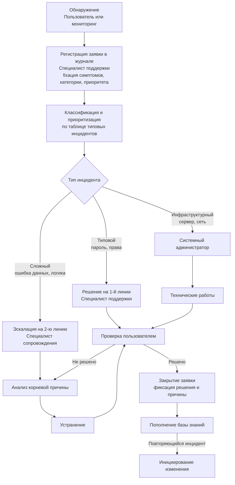
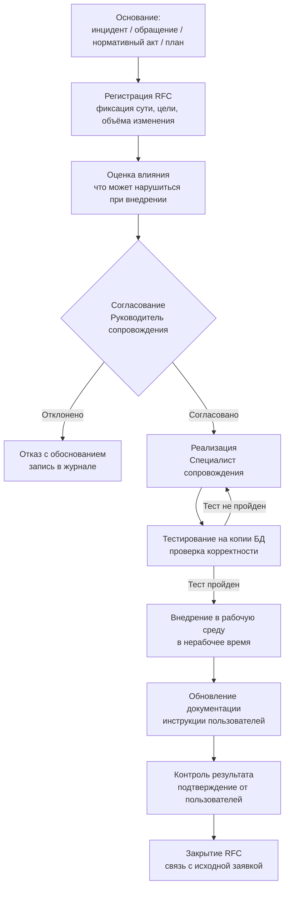

# Практика

> Внимание! Все схемы в примере являются схематичными, требуется учитывать нотации при создании отчёта.

## Этап 3. Анализ инцидентов, обращений и управление изменениями

---

# Что требуется выполнить в данном разделе

В рамках Этапа 3 студент обязан:

1. Разграничить инцидентные и сервисные обращения для своей системы с примерами.
2. Составить таблицу типовых инцидентов с причинами, последствиями, критичностью и ответственными.
3. Описать жизненный цикл обработки инцидента и построить соответствующую схему.
4. Разобрать не менее 2–3 конкретных инцидентов: что произошло, почему, как было устранено.
5. Описать виды изменений для своей системы с примерами.
6. Изложить порядок управления изменениями и построить схему процесса.
7. Показать причинно-следственную связь: какие инциденты привели к каким изменениям.

---

# Важно

Приведённые ниже инциденты и изменения основаны на эксплуатации АИС «Деканат» из Этапов 1–2. Студент описывает **реальные или достоверно моделируемые** ситуации своей системы.

---

## 3.1. Классификация обращений пользователей АИС «Деканат»

### 3.1.1. Инцидентные обращения

Ситуации, при которых система функционирует с нарушением:

* пользователь не может войти в систему (ошибка аутентификации, блокировка учётной записи);
* ошибка при сохранении оценки или записи о посещаемости;
* недоступность модуля расписания;
* некорректное отображение данных в ведомости (неверный расчёт среднего балла);
* ошибка при формировании отчёта (выгрузка пустая или содержит неверные данные);
* система недоступна полностью (сервер не отвечает).

### 3.1.2. Сервисные обращения

Ситуации, при которых система работает штатно, но нужна помощь или доработка:

* запрос нового фильтра в журнале успеваемости («нужен фильтр по задолженностям»);
* обучение нового преподавателя работе с системой;
* запрос нового формата выгрузки (по требованию нового бланка ведомости);
* запрос на добавление новой специальности в справочник;
* запрос на изменение правил блокировки учётной записи.

---

## 3.2. Характеристика типовых инцидентов

| № | Инцидент | Возможная причина | Последствия | Критичность | Ответственный |
|---|----------|------------------|-------------|:-----------:|:-------------:|
| 1 | Пользователь не может войти в систему | Ошибка пароля; истёк срок действия; блокировка после 5 неудачных попыток | Простой пользователя; задержка ввода данных | Средняя | Специалист поддержки |
| 2 | Ошибка при сохранении оценки | Потеря соединения с БД в момент записи; конкурентный доступ к записи | Потеря введённых данных; необходимость повторного ввода | Высокая | Специалист сопровождения |
| 3 | Система полностью недоступна | Зависание Apache; переполнение диска на сервере; сетевой сбой | Полная остановка учебной части и преподавателей | Критическая | Системный администратор |
| 4 | Некорректный расчёт среднего балла в ведомости | Ошибка в формуле при учёте пересдач | Неверные данные в официальных документах | Высокая | Специалист сопровождения |
| 5 | Права доступа не соответствуют роли | Ошибка при заведении нового пользователя; не удалена учётная запись уволенного | Риск несанкционированного доступа или блокировки работы | Высокая | Системный администратор |
| 6 | Медленная загрузка модуля отчётности | Рост объёма данных в БД; неоптимизированные запросы | Задержка при формировании ведомостей в период сессии | Средняя | Специалист сопровождения |
| 7 | Дублирование записи студента в системе | Параллельный ввод разными секретарями; отсутствие проверки уникальности | Путаница в данных; ошибки в отчётах | Средняя | Специалист сопровождения |

---

## 3.3. Жизненный цикл обработки инцидента

### 3.3.1. Схема жизненного цикла

///caption
Рисунок 1 – Жизненный цикл обработки инцидента в АИС «Деканат»
///

### 3.3.2. Разбор конкретных инцидентов

---

#### Инцидент А: «Система недоступна в начале учебного дня»

**Ситуация:** В 8:15 секретарь учебной части обнаружила, что АИС «Деканат» не открывается в браузере. Сообщения об ошибке: «504 Gateway Timeout».

**Шаг 1 — Обнаружение:** Секретарь сообщила методисту по телефону в 8:17.

**Шаг 2 — Регистрация:** Методист зафиксировал заявку в журнале в 8:20. Приоритет: Критический (система полностью недоступна).

**Шаг 3 — Классификация:** Инфраструктурный инцидент → эскалация системному администратору.

**Шаг 4 — Анализ:** Администратор подключился к серверу. Причина: Apache завис из-за исчерпания лимита подключений к MySQL (параметр `max_connections` = 50, в 8:00–8:30 одновременно подключились 53 пользователя).

**Шаг 5 — Устранение:** Перезапуск Apache; увеличение `max_connections` до 100.

**Шаг 6 — Проверка:** Секретарь подтвердила доступность в 8:52.

**Шаг 7 — Закрытие:** Заявка закрыта в 9:00. В журнале зафиксировано: причина, решение, рекомендация — настроить мониторинг числа подключений.

**Корневая причина:** Конфигурация сервера не была пересмотрена при росте числа пользователей за последний учебный год.

**Время устранения:** 32 минуты (в рамках SLA для критического инцидента — до 2 часов).

---

#### Инцидент Б: «Некорректный средний балл в ведомости»

**Ситуация:** Заведующий отделением при проверке ведомости промежуточной аттестации обнаружил, что средний балл студента, имеющего пересдачу, рассчитан некорректно (учитывается первая оценка, а не итоговая после пересдачи).

**Регистрация:** Заявка высокого приоритета. Передана специалисту сопровождения.

**Анализ:** В коде функции расчёта среднего балла не предусмотрена выборка именно последней записи оценки по предмету — берётся первая по дате. При повторных попытках сдачи в таблице хранятся все оценки, но алгоритм не отбирает нужную.

**Устранение:** Внесено изменение в запрос к БД (`ORDER BY date DESC LIMIT 1`). Изменение протестировано на тестовой копии БД.

**Проверка:** Ведомость пересчитана; заведующий подтвердил корректность.

**Связь с управлением изменениями:** По итогам инцидента инициирован запрос на изменение RFC-2024-03 «Корректировка алгоритма расчёта среднего балла с учётом пересдач». Изменение внедрено как **корректирующее**.

---

## 3.4. Управление изменениями в АИС «Деканат»

### 3.4.1. Виды изменений и их основания

| Вид изменения | Основание | Пример |
|---------------|----------|--------|
| **Корректирующее** | Устранение выявленного дефекта | RFC-2024-03: исправление алгоритма расчёта среднего балла |
| **Адаптивное** | Изменение нормативных требований | RFC-2024-07: новый формат выгрузки ведомости по требованию Министерства |
| **Совершенствующее** | Запросы пользователей | RFC-2024-11: добавление фильтра «студенты с задолженностью» в модуль успеваемости |
| **Профилактическое** | Анализ деградации | RFC-2024-15: оптимизация индексов БД при росте объёма данных свыше 500 000 записей |

### 3.4.2. Порядок управления изменением

///caption
Рисунок 2 – Процесс управления изменениями в АИС «Деканат»
///

### 3.4.3. Подробный разбор одного изменения

#### RFC-2024-07: «Новый формат выгрузки ведомости итоговой аттестации»

**Основание:** Приказ Министерства образования от сентября 2024 года, устанавливающий новую форму ведомости итоговой аттестации с обязательным указанием кода специальности ФГОС.

**Вид изменения:** Адаптивное.

**Шаг 1 — Инициирование:** Заместитель директора по учебной работе уведомила руководителя сопровождения об изменении формы.

**Шаг 2 — Регистрация RFC:** Специалист сопровождения зафиксировал запрос. Описание: добавить в шаблон выгрузки ведомости поле «Код специальности ФГОС»; обновить запрос к БД для получения данного поля.

**Шаг 3 — Оценка влияния:** Изменяется только шаблон выгрузки (PHP-шаблон + SQL-запрос). Остальные модули не затрагиваются. Риск низкий.

**Шаг 4 — Согласование:** Руководитель сопровождения согласовал. Срок реализации — 5 рабочих дней до начала сессии.

**Шаг 5 — Реализация:** Специалист сопровождения внёс изменения в шаблон выгрузки и запрос. В справочник специальностей добавлено поле «Код ФГОС».

**Шаг 6 — Тестирование:** Выгрузка проверена на тестовой копии БД с данными одной группы. Поле отображается корректно. Протокол тестирования подписан.

**Шаг 7 — Внедрение:** Изменение внедрено в пятницу вечером (нерабочее время).

**Шаг 8 — Обновление документации:** В руководстве пользователя для секретаря учебной части добавлено описание нового поля в ведомости.

**Шаг 9 — Контроль результата:** Секретарь сформировала ведомость в понедельник утром и подтвердила корректность. RFC-2024-07 закрыт.

---

## 3.5. Вывод по этапу 3

По итогам Этапа 3 зафиксировано:

1. **Классификация обращений** — 7 типов инцидентных обращений и 5 типов сервисных обращений для АИС «Деканат».

2. **Типовые инциденты** — 7 инцидентов с характеристикой причин, последствий, критичности и ответственных.

3. **Жизненный цикл инцидента** — 9 шагов от обнаружения до закрытия и пополнения базы знаний; разобраны 2 конкретных случая.

4. **Виды изменений** — 4 изменения разного типа (корректирующее, адаптивное, совершенствующее, профилактическое).

5. **Процедура управления изменениями** — 9 шагов от инициирования до закрытия RFC; разобрано 1 изменение подробно.

Накопленные данные об инцидентах и изменениях становятся **входными данными для Этапа 4**: метрики качества будут рассчитываться именно на их основе.
