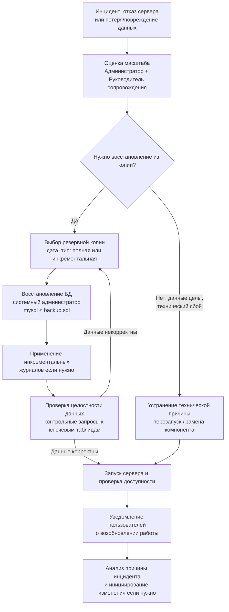
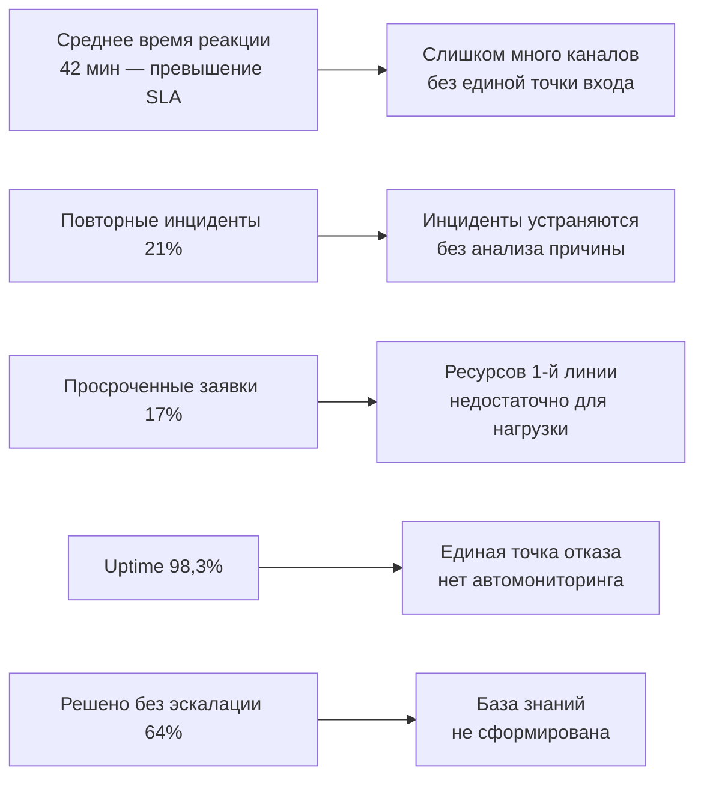
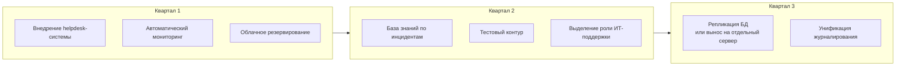

# Практика

> Внимание! Все схемы в примере являются схематичными, требуется учитывать нотации при создании отчёта.

## Этап 4. Обеспечение непрерывности и контроль качества сопровождения

---

# Что требуется выполнить в данном разделе

В рамках Этапа 4 студент обязан:

1. Определить объекты и регламент резервного копирования для своей системы.
2. Описать порядок восстановления: триггеры, источник, ответственные, проверка.
3. Определить, какие события подлежат журналированию и для каких целей.
4. Описать параметры мониторинга: что отслеживается, пороги тревоги, оповещение.
5. Сформировать перечень метрик качества с единицами измерения и эталонными значениями.
6. Интерпретировать метрики: связать каждый показатель с возможной проблемой.
7. Сформулировать конкретные меры по совершенствованию с обоснованием.

---

# Важно

Приведённый пример основан на АИС «Деканат» из Этапов 1–3. Студент выполняет аналогичную работу для своей системы, **не копируя** данный пример.

---

## 4.1. Резервное копирование и восстановление

### 4.1.1. Объекты и регламент резервного копирования

| Объект | Периодичность | Метод | Место хранения | Срок хранения | Ответственный |
|--------|:------------:|-------|----------------|:-------------:|:-------------:|
| База данных MySQL (полная копия) | Ежедневно в 02:00 | `mysqldump` | Внешний HDD (в серверной) | 30 дней | Системный администратор |
| Инкрементальная копия БД (изменения за день) | Каждые 4 часа | Бинарный лог MySQL | Внешний HDD | 7 дней | Системный администратор |
| Файлы конфигурации Apache и PHP | При каждом изменении | Ручное копирование в архив | Флэш-накопитель + облако (Яндекс Диск) | Бессрочно | Администратор |
| Шаблоны документов и инструкции | Еженедельно | Копирование на сетевой диск | Сервер документов | 12 месяцев | Специалист сопровождения |
| Журналы системы (логи Apache, MySQL) | Ежедневная ротация | Автоматически (logrotate) | Архивная папка на сервере | 90 дней | Администратор |

> **Выявленный риск.** Резервные копии хранятся на том же физическом устройстве (сервер + внешний HDD в той же серверной), что не защищает от пожара, кражи или разрушения помещения. Рекомендация: дублировать ежедневную копию в облачное хранилище (будет включено в меры по совершенствованию).

### 4.1.2. Параметры надёжности

| Показатель | Значение |
|------------|---------|
| **RPO** (допустимая потеря данных) | Не более 4 часов (интервал инкрементальной копии) |
| **RTO** (допустимое время восстановления) | Не более 2 часов (из паспорта системы — Этап 1) |

### 4.1.3. Схема и порядок восстановления

///caption
Рисунок 1 – Процедура восстановления АИС «Деканат» после инцидента
///

**Ответственные при восстановлении:**

* **Решение о начале восстановления** — Руководитель сопровождения (заместитель директора по ИТ).
* **Технические работы** — Системный администратор.
* **Проверка данных после восстановления** — Специалист сопровождения совместно с секретарём учебной части.
* **Уведомление пользователей** — Специалист поддержки.

---

## 4.2. Журналирование и мониторинг

### 4.2.1. События, подлежащие журналированию

| Категория | Конкретные события | Цель хранения | Хранение |
|-----------|-------------------|---------------|---------|
| Аутентификация | Вход в систему (успешный/неуспешный); смена пароля; блокировка учётной записи | Безопасность; расследование инцидентов | 90 дней |
| Действия с данными студентов | Создание, изменение, удаление записи о студенте; изменение статуса | Аудит; контроль целостности данных | 3 года |
| Оценки и посещаемость | Внесение/изменение оценки; отметка посещаемости | Аудит; расследование спорных ситуаций | 5 лет |
| Административные действия | Создание/блокировка пользователя; изменение прав доступа | Безопасность; контроль конфигурации | 2 года |
| Системные ошибки | PHP-ошибки; ошибки MySQL; тайм-ауты | Диагностика инцидентов | 90 дней |
| Медленные запросы | Запросы к БД длительностью > 2 секунд | Профилактика деградации производительности | 30 дней |

### 4.2.2. Параметры мониторинга

| Параметр | Инструмент | Порог тревоги | Кто получает оповещение |
|----------|:----------:|:-------------:|:-----------------------:|
| Доступность web-сервера (HTTP 200) | Автоматический скрипт (cron + curl) | Нет ответа > 2 минуты | Системный администратор (SMS) |
| Загрузка CPU сервера | `top` / скрипт | > 85% более 5 минут | Системный администратор (email) |
| Свободное место на диске | `df` / скрипт | < 15% свободного | Системный администратор (email) |
| Число подключений к MySQL | MySQL Performance Schema | > 90 одновременных | Системный администратор (email) |
| Медленные запросы (slow query) | MySQL slow query log | > 5 за 10 минут | Специалист сопровождения (email) |
| Резервное копирование | Лог результата cron-задачи | Задача не выполнена | Системный администратор (email) |

> **Текущее состояние.** В АИС «Деканат» мониторинг реализован частично: доступность проверяется вручную (секретарь пробует зайти); медленные запросы фиксируются в логе, но не анализируются регулярно. Это является выявленной проблемой, которая включена в меры по совершенствованию.

---

## 4.3. Метрики качества сопровождения

### 4.3.1. Расчёт и целевые значения метрик

Данные для расчёта: журнал заявок за 3 учебных месяца (сентябрь–ноябрь), 47 зарегистрированных обращений.

| Метрика | Формула / источник данных | Факт (за период) | Целевое значение |
|---------|--------------------------|:----------------:|:----------------:|
| Среднее время реакции | Σ(время реакции) / кол-во заявок | 42 минуты | ≤ 30 минут (SLA 1-я линия) |
| Среднее время устранения | Σ(время устранения) / кол-во заявок | 5,2 рабочих часа | ≤ 4 часа (высокий приоритет) |
| Доступность системы (Uptime) | (Рабочее время − Простой) / Рабочее время × 100% | 98,3% | ≥ 99% |
| Уровень повторных инцидентов | Инциденты с той же причиной / Всего × 100% | 21% | < 10% |
| Просроченные заявки | Заявки за пределами SLA / Всего × 100% | 17% | < 5% |
| Решено без эскалации (1-я линия) | Заявки 1-й линии / Всего × 100% | 64% | > 70% |
| Среднее число инцидентов в месяц | Всего инцидентов / Число месяцев | 15,7 | Снижение на 20% за год |

### 4.3.2. Интерпретация метрик

///caption
Рисунок 2 – Интерпретация метрик качества сопровождения АИС «Деканат»
///

**Детализация проблем:**

| Метрика | Значение | Вывод |
|---------|---------|-------|
| Среднее время реакции — 42 мин | Превышает SLA для средних обращений | Часть обращений поступает по каналам без немедленной фиксации (устно, мессенджер); нет автоматической регистрации |
| Повторные инциденты — 21% | Значительно выше нормы | После закрытия заявок корневая причина не всегда анализируется; база знаний фактически отсутствует |
| Просроченные заявки — 17% | Существенное нарушение SLA | Специалист поддержки перегружен: совмещает функции методиста и технической поддержки |
| Uptime — 98,3% | Ниже целевого в 99% | Два незапланированных простоя за период (32 и 41 минута); мониторинг отсутствует — проблемы обнаруживаются пользователями |
| Решено без эскалации — 64% | Ниже целевого | Специалист 1-й линии не имеет инструментария (базы знаний) для самостоятельного решения ряда типовых ситуаций |

---

## 4.4. Предложения по совершенствованию

### 4.4.1. Перечень мер

| № | Выявленная проблема | Предлагаемая мера | Ожидаемый эффект | Приоритет |
|---|--------------------|--------------------|-----------------|:---------:|
| 1 | Нет единой точки регистрации обращений; Excel-журнал не контролирует SLA | Внедрить helpdesk-систему (например, GLPI или Redmine) с обязательной регистрацией всех обращений | Снижение просроченных заявок; автоматический контроль SLA | Высокий |
| 2 | Высокий уровень повторных инцидентов (21%); нет базы знаний | Создать базу знаний по типовым инцидентам АИС «Деканат» (Wiki или раздел в helpdesk) | Снижение повторных инцидентов до < 10%; рост доли решённых без эскалации | Высокий |
| 3 | Мониторинг доступности выполняется вручную | Настроить автоматический мониторинг доступности (Uptime Robot или cron-скрипт с уведомлениями) | Сокращение времени обнаружения сбоев; снижение фактического простоя | Высокий |
| 4 | Резервные копии хранятся только локально (нет внешнего хранилища) | Настроить автоматическую выгрузку ежедневной резервной копии в облако (Яндекс Диск / S3) | Защита данных при физическом повреждении серверной | Высокий |
| 5 | Единственная точка отказа (всё на одном сервере) | Перенести БД на отдельный сервер или настроить репликацию MySQL | Снижение риска полного отказа при сбое одного компонента | Средний |
| 6 | Специалист поддержки перегружен (совмещает методиста и ИТ) | Выделить роль ИТ-специалиста поддержки или ввести дежурного администратора | Снижение просроченных заявок; соблюдение SLA | Средний |
| 7 | Отсутствует тестовый контур | Создать копию системы для тестирования изменений (отдельная БД + папка на сервере) | Снижение риска инцидентов после внедрения изменений | Средний |
| 8 | Журналирование действий с данными не унифицировано | Внедрить единый механизм аудита: таблица `audit_log` в БД с записью всех изменений | Возможность расследования инцидентов с данными; контроль доступа | Низкий |

### 4.4.2. Дорожная карта совершенствования

///caption
Рисунок 3 – Дорожная карта совершенствования сопровождения АИС «Деканат»
///

---

## 4.5. Вывод по этапу 4

По итогам Этапа 4 для АИС «Деканат» зафиксировано:

1. **Политика резервного копирования** — 5 объектов, периодичность от «при изменении» до «ежедневно»; RPO = 4 часа; выявлен риск отсутствия внешнего хранилища.

2. **Процедура восстановления** — определены триггеры, источник, ответственные и этапы проверки; процедура документирована и готова к использованию при инциденте.

3. **Журналирование** — определены 6 категорий событий с периодами хранения от 30 дней до 5 лет.

4. **Мониторинг** — определены 6 параметров с порогами и ответственными; выявлено, что мониторинг доступности выполняется вручную.

5. **Метрики качества** — рассчитаны 7 показателей; выявлены проблемы: превышение SLA по времени реакции, высокий уровень повторных инцидентов, Uptime ниже целевого.

6. **Меры по совершенствованию** — 8 мер с обоснованием, ожидаемым эффектом и приоритетом; сформирована дорожная карта на 3 квартала.

---

## Итоговый вывод по практике

В результате выполнения практики по сопровождению АИС «Деканат» последовательно проработаны все четыре уровня:

| Этап | Результат |
|------|-----------|
| **Этап 1** | Паспорт эксплуатируемой системы: назначение, пользователи, среда, критичность |
| **Этап 2** | Организационная модель: 5 ролей, 14 процессов, SLA по 4 приоритетам |
| **Этап 3** | Типология инцидентов, жизненный цикл, 4 RFC, процедура управления изменениями |
| **Этап 4** | Политика резервирования, мониторинг, 7 метрик, 8 мер по совершенствованию |

Сквозная логика **«объект → организация → проблемы → качество»** обеспечила последовательное и взаимосвязанное рассмотрение всех аспектов сопровождения информационной системы.
