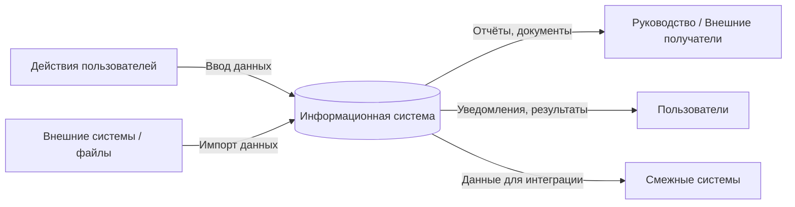
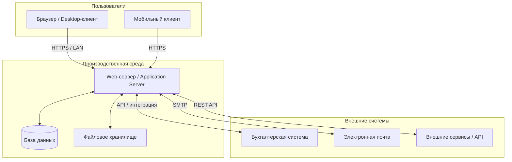
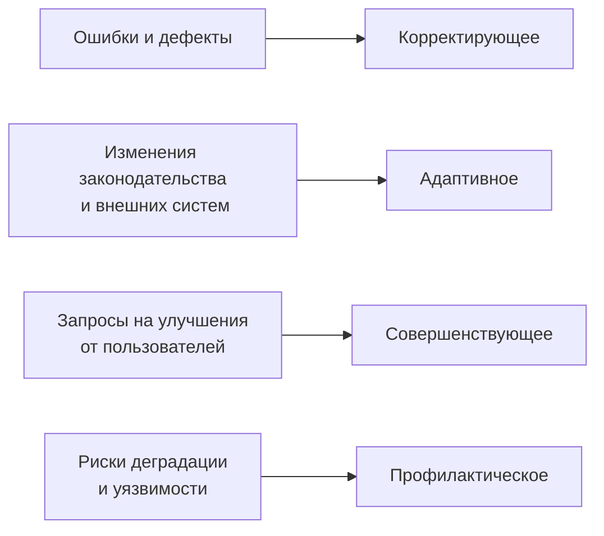

# Теория

## Этап 1. Характеристика сопровождаемой информационной системы в условиях эксплуатации

> Внимание! Все схемы в примере являются схематичными, требуется учитывать нотации при создании отчёта.

---

### 1.1. Понятие сопровождения информационной системы

**Сопровождение информационной системы** — совокупность работ, выполняемых после ввода системы в эксплуатацию с целью поддержания её работоспособности, соответствия изменяющимся требованиям и обеспечения непрерывности деятельности организации.

В отличие от **разработки**, которая создаёт систему, сопровождение работает с уже функционирующим продуктом. Объектом сопровождения является не концепт или проект, а живая система, от которой зависит ежедневная деятельность пользователей.

Согласно международному стандарту ГОСТ Р ИСО/МЭК 14764, сопровождение включает четыре вида деятельности:

| Вид сопровождения | Цель | Пример |
|-------------------|------|--------|
| **Корректирующее** | Устранение обнаруженных дефектов | Исправление ошибки в расчёте |
| **Адаптивное** | Приспособление к изменениям среды | Переход на новый формат отчётности |
| **Совершенствующее** | Улучшение функционала по запросам | Добавление нового фильтра в отчёт |
| **Профилактическое** | Предотвращение будущих сбоев | Оптимизация медленных запросов к БД |

Понимание вида сопровождения важно для корректной классификации обращений (Этап 3) и планирования ресурсов службы.

---

### 1.2. Паспорт эксплуатируемой системы как основа сопровождения

**Паспорт системы** — документ, фиксирующий ключевые характеристики ИС как объекта эксплуатации. Он не описывает, как система спроектирована, а описывает, как она используется в реальных условиях.

Паспорт отвечает на вопросы:

* **Что сопровождается?** — назначение, функции, обрабатываемые данные.
* **Кто использует?** — категории пользователей и их зависимость от системы.
* **В каких условиях?** — тип системы, техническая среда, режим работы.
* **Почему требует сопровождения?** — факторы, порождающие необходимость поддержки.

Паспорт является **исходными данными** для всех последующих этапов практики: без него невозможно ни выстроить службу поддержки (Этап 2), ни корректно классифицировать инциденты (Этап 3), ни определить требования к непрерывности работы (Этап 4).

---

### 1.3. Назначение системы в эксплуатации

#### 1.3.1. Что описывает данный раздел

Раздел фиксирует фактическое использование системы: для каких задач она применяется ежедневно, какие операции выполняют пользователи, какие данные в ней обрабатываются.

Важно разграничить:

* **Назначение по проекту** — для чего система создавалась;
* **Назначение в эксплуатации** — для чего она фактически используется сейчас.

Расхождение между этими двумя версиями само по себе является информацией для анализа: оно указывает на то, что функционал может использоваться нестандартно, а часть возможностей — простаивать.

#### 1.3.2. Типовой перечень характеристик

При описании назначения системы фиксируются:

* **Основные функции** — какие операции выполняет система в ежедневном режиме;
* **Обрабатываемые данные** — какие сущности хранятся и обновляются (клиенты, заявки, документы, финансы и т.д.);
* **Входные данные** — что поступает в систему извне (данные от пользователей, внешних систем, сканеров документов);
* **Выходные данные** — что система выдаёт (отчёты, уведомления, документы, ответы на запросы).

///caption
Рисунок 1 – Обобщённая схема взаимодействия системы со средой эксплуатации
///

**Пояснение к рисунку 1:**

* система получает данные от пользователей через интерфейс и от внешних систем через интеграцию;
* на выходе формируются отчёты для руководства, результаты работы для пользователей и данные для смежных систем;
* именно эти потоки определяют, кто зависит от системы и что происходит при её недоступности.

---

### 1.4. Категории пользователей и их зависимость от системы

#### 1.4.1. Зачем анализировать зависимость пользователей

Зависимость пользователей от системы определяет **критичность её отказов**. Если система недоступна час, но пользователи могут выполнить операции вручную — это одна ситуация. Если система является единственным способом выполнить задачу, а задача должна быть выполнена немедленно — это совершенно другое.

Именно степень зависимости пользователей обосновывает требования к срокам устранения инцидентов (SLA), которые будут установлены в Этапе 2.

#### 1.4.2. Виды зависимости

| Степень зависимости | Описание | Влияние на SLA |
|---------------------|----------|----------------|
| **Критическая** | Без системы деятельность невозможна; ручная альтернатива отсутствует | Минимальное допустимое время недоступности |
| **Высокая** | Без системы деятельность существенно затруднена; частичная ручная альтернатива возможна, но трудозатратна | Короткий SLA |
| **Средняя** | Без системы часть функций выполняется вручную; потери есть, но критичной остановки нет | Умеренный SLA |
| **Низкая** | Система удобна, но не обязательна; полная ручная альтернатива есть | Мягкий SLA |

#### 1.4.3. Типовые категории пользователей

В зависимости от типа системы могут быть выделены следующие категории:

| Категория | Характер работы с системой | Типичная зависимость |
|-----------|---------------------------|----------------------|
| Операционные пользователи | Работают в системе постоянно, вводят первичные данные | Высокая / критическая |
| Менеджеры / руководители | Используют для принятия решений и контроля | Средняя |
| Аналитики / контролёры | Формируют отчёты и аналитику | Средняя |
| Администраторы системы | Настраивают, обслуживают, управляют правами | Высокая |
| Внешние пользователи / клиенты | Используют через публичный интерфейс (если есть) | Зависит от модели |

---

### 1.5. Эксплуатационная среда

Эксплуатационная среда определяет технические условия, в которых работает система, и является основой для анализа рисков сбоев.

#### 1.5.1. Архитектурный тип системы

| Тип | Характеристика | Особенности сопровождения |
|-----|----------------|---------------------------|
| Web-приложение | Работает в браузере, сервер в сети | Обновления централизованы; зависит от сети и сервера |
| Desktop | Устанавливается на рабочих местах | Обновления на каждое рабочее место; меньше зависимость от сети |
| Мобильное | Работает на смартфонах/планшетах | Обновления через магазин приложений; разнообразие устройств |
| Клиент-серверное | Клиент + сервер, оба имеют логику | Сопровождение обеих компонент |
| Облачная (SaaS) | Размещена у провайдера | Ограниченный контроль; SLA с провайдером |
| Гибридное | Часть локально, часть в облаке | Сложная зависимость; нужен мониторинг обеих частей |

#### 1.5.2. Ключевые параметры эксплуатационной среды

Для паспорта системы фиксируются следующие параметры:

* **Количество пользователей** — одновременно работающих и общее число учётных записей;
* **Режим работы** — часы доступности системы (круглосуточно, в рабочие часы, по расписанию);
* **Серверная инфраструктура** — собственные серверы, облако, виртуализация;
* **СУБД** — какая база данных используется и её критичность;
* **Интеграции** — с какими внешними системами связана ИС (бухгалтерия, почта, ЭДО и т.д.);
* **Критичность отказов** — время, в течение которого система может быть недоступна без серьёзных последствий.

///caption
Рисунок 2 – Типовая схема эксплуатационной среды информационной системы
///

**Пояснение к рисунку 2:**

* пользователи обращаются к системе через браузер, клиентское приложение или мобильное устройство;
* серверная часть включает application server, базу данных и файловое хранилище — каждый компонент является потенциальной точкой отказа;
* внешние интеграции создают дополнительные зависимости: сбой внешней системы может привести к инцидентам в сопровождаемой ИС.

---

### 1.6. Факторы, обуславливающие необходимость сопровождения

Ни одна информационная система не работает бесконечно в стабильном состоянии без поддержки. Факторы, порождающие потребность в сопровождении, принято разделять на внутренние и внешние.

#### 1.6.1. Внутренние факторы

| Фактор | Описание |
|--------|----------|
| **Ошибки и дефекты** | Ошибки, не выявленные при тестировании; ошибки, возникающие при определённых условиях |
| **Деградация данных** | Накопление «мусорных» записей, конфликты при параллельном вводе, устаревание данных |
| **Рост нагрузки** | Увеличение числа пользователей или объёма данных приводит к снижению производительности |
| **Техническое устаревание** | Изменения в операционных системах, библиотеках, браузерах нарушают совместимость |
| **Проблемы безопасности** | Обнаруженные уязвимости требуют патчей и настройки |

#### 1.6.2. Внешние факторы

| Фактор | Описание |
|--------|----------|
| **Изменения нормативной базы** | Новые требования законодательства или регуляторов изменяют форматы отчётности, порядок хранения данных |
| **Изменения внешних систем** | Обновление API партнёров, изменение форматов интеграции |
| **Запросы пользователей** | Новые бизнес-требования, расширение функционала, изменения рабочих процессов |
| **Консультационная поддержка** | Пользователи нуждаются в помощи по работе с системой |

#### 1.6.3. Классификация факторов по виду сопровождения

///caption
Рисунок 3 – Связь факторов сопровождения с видами деятельности
///

**Пояснение к рисунку 3:**

* каждый фактор, обусловливающий необходимость сопровождения, соответствует одному из четырёх видов сопровождения по ГОСТ;
* анализ факторов позволяет заранее планировать состав процессов и ресурсы службы.

---

### 1.7. Результат этапа

По итогам Этапа 1 документируется паспорт эксплуатируемой системы, включающий:

1. **Назначение системы в эксплуатации** — что делает система, какие данные обрабатывает.
2. **Категории пользователей** — кто работает с системой и как зависит от её работоспособности.
3. **Эксплуатационная среда** — тип системы, технический стек, режим работы, критичность отказов.
4. **Факторы сопровождения** — почему система требует постоянной поддержки.

Этот паспорт служит **фундаментом для Этапа 2**: именно категории пользователей и критичность отказов определяют, какие роли нужны в службе сопровождения и каким должен быть регламент реагирования.
