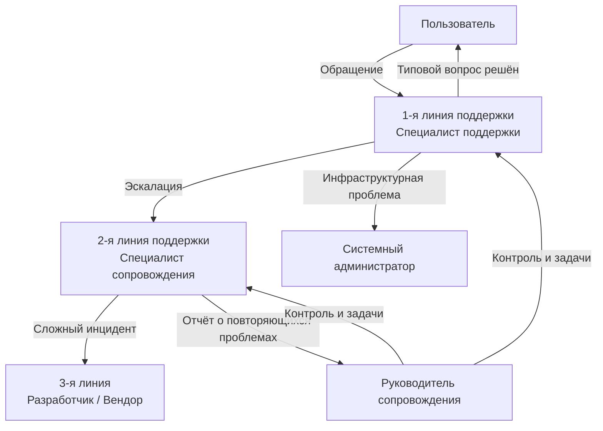
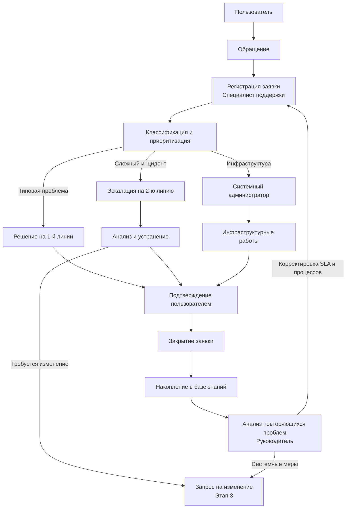

# Теория

## Этап 2. Организация службы сопровождения: роли, процессы и регламент

> Внимание! Все схемы в примере являются схематичными, требуется учитывать нотации при создании отчёта.

---

### 2.1. Структура службы сопровождения

**Служба сопровождения** — организационная единица, ответственная за поддержание работоспособности информационной системы и обработку обращений пользователей. В зависимости от масштаба организации и критичности системы она может быть выделенной (отдельный отдел) или совмещённой (функции распределены между сотрудниками ИТ-подразделения).

Ключевой принцип организации службы: **ответственность за каждый процесс должна быть закреплена за конкретной ролью**. Роль — это набор функций, обязанностей и полномочий, а не обязательно отдельная должность: один человек может выполнять несколько ролей.

#### 2.1.1. Многоуровневая модель поддержки

Международная практика ITSM (IT Service Management) предполагает **многоуровневую (эшелонированную) модель** обработки обращений:

///caption
Рисунок 1 – Многоуровневая модель службы сопровождения
///

**Пояснение к рисунку 1:**

* 1-я линия принимает все обращения и решает типовые проблемы без эскалации;
* 2-я линия занимается сложными инцидентами, требующими анализа и изменений;
* 3-я линия (разработчик или вендор) подключается при проблемах с кодом или лицензиями;
* системный администратор решает инфраструктурные задачи параллельно;
* руководитель контролирует все линии и несёт ответственность за SLA.

---

### 2.2. Роли и ответственности

#### 2.2.1. Описание ролей

| Роль | Функции в сопровождении | Ответственность |
|------|------------------------|-----------------|
| **Пользователь** | Сообщает о проблеме, предоставляет описание, подтверждает результат | Своевременная и корректная подача обращения |
| **Специалист поддержки (1-я линия)** | Регистрирует обращения, классифицирует, решает типовые инциденты | Корректная регистрация; соблюдение времени реакции |
| **Специалист сопровождения (2-я линия)** | Анализирует сложные инциденты, устраняет ошибки, вносит изменения | Качество устранения; документирование решений |
| **Системный администратор** | Решает инфраструктурные проблемы, выполняет резервное копирование, контролирует доступность | Доступность инфраструктуры; актуальность резервных копий |
| **Руководитель сопровождения** | Контролирует сроки, анализирует повторяющиеся проблемы, оценивает качество | SLA по всем обращениям; отчётность о качестве |

#### 2.2.2. Матрица ответственности (RACI)

RACI-матрица распределяет участие ролей в процессах: **R** — исполняет (Responsible), **A** — отвечает (Accountable), **C** — консультирует (Consulted), **I** — информируется (Informed).

| Процесс | Пользователь | Сп. поддержки | Сп. сопровождения | Сис. администратор | Руководитель |
|---------|:---:|:---:|:---:|:---:|:---:|
| Регистрация обращения | C | R/A | I | I | I |
| Классификация инцидента | I | R | A | I | I |
| Решение типового инцидента | I | R/A | C | I | I |
| Эскалация и анализ сложного инцидента | I | R | R/A | C | I |
| Инфраструктурные работы | I | I | C | R/A | I |
| Управление изменением | I | I | R | C | A |
| Резервное копирование | I | I | I | R/A | I |
| Контроль качества | I | I | C | I | R/A |

---

### 2.3. Классификация и состав процессов сопровождения

Все процессы сопровождения делятся на три типа.

#### 2.3.1. Основные процессы

Непосредственно направлены на поддержание работоспособности системы:

* **Регистрация и обработка обращений** — фиксация каждого инцидента или запроса в системе учёта;
* **Устранение инцидентов и ошибок** — диагностика и восстановление нормального функционирования;
* **Установка обновлений** — плановые обновления программного обеспечения;
* **Восстановление после сбоев** — действия при критических отказах, использование резервных копий.

#### 2.3.2. Вспомогательные процессы

Обеспечивают условия для выполнения основных:

* **Резервное копирование** — регулярное создание копий данных и конфигураций;
* **Журналирование и мониторинг** — непрерывный сбор данных о состоянии системы;
* **Консультационная поддержка** — обучение и консультации пользователей;
* **Тестирование изменений** — проверка корректности изменений перед внедрением;
* **Актуализация документации** — поддержание актуальности инструкций и регламентов.

#### 2.3.3. Управляющие процессы

Контролируют качество и развитие сопровождения:

* **Контроль SLA** — мониторинг соблюдения сроков обработки обращений;
* **Анализ повторяющихся проблем** — выявление системных причин инцидентов;
* **Планирование релизов** — координация плановых обновлений;
* **Отчётность о доступности системы** — периодические отчёты для руководства.

#### 2.3.4. Характеристика процессов сопровождения

| Процесс | Тип | Входы | Выходы | Ответственный |
|---------|-----|-------|--------|---------------|
| Регистрация обращения | Основной | Сообщение пользователя | Зарегистрированная заявка | Специалист поддержки |
| Обработка инцидента | Основной | Заявка, журнал ошибок | Устранённый инцидент / эскалация | Специалист сопровождения |
| Установка обновления | Основной | Пакет обновления, план релиза | Обновлённая версия системы | Системный администратор |
| Резервное копирование | Вспомогательный | Данные БД, файлы системы | Резервная копия | Системный администратор |
| Консультация пользователя | Вспомогательный | Вопрос пользователя | Ответ / инструкция | Специалист поддержки |
| Тестирование изменения | Вспомогательный | Изменение, тест-кейсы | Протокол тестирования | Специалист сопровождения |
| Актуализация документации | Вспомогательный | Изменения в системе | Обновлённая инструкция | Специалист сопровождения |
| Контроль SLA | Управляющий | Журнал заявок | Отчёт по срокам | Руководитель |
| Анализ повторяющихся проблем | Управляющий | База инцидентов | Выявленные паттерны | Руководитель |
| Планирование релизов | Управляющий | Список изменений | План обновления | Руководитель |

---

### 2.4. Каналы поступления обращений

Обращения пользователей могут поступать через различные каналы. Независимо от канала, **все обращения должны регистрироваться в единой системе учёта** — только это обеспечивает контроль сроков и накопление аналитики.

| Канал | Преимущества | Ограничения |
|-------|-------------|-------------|
| **Helpdesk / Service Desk** | Автоматическая регистрация; привязка к SLA | Требует обучения пользователей |
| **Электронная почта** | Привычный инструмент; сохраняет историю | Требует ручной регистрации в системе учёта |
| **Телефон** | Удобен при срочных проблемах | Отсутствует автоматическая запись; нужна ручная фиксация |
| **Мессенджер** | Быстрый отклик; история переписки | Трудно выдержать SLA; нужна регистрация |
| **Форма в системе** | Структурированные данные; удобная классификация | Недоступна при отказе системы |
| **Устное обращение** | Быстро; подходит для простых вопросов | Обязательна последующая письменная регистрация |

---

### 2.5. Регламент реагирования (SLA)

**SLA (Service Level Agreement)** — соглашение об уровне обслуживания. В контексте сопровождения ИС это документ, фиксирующий: какой тип обращения в какие сроки должен быть зарегистрирован, в какие — рассмотрен, в какие — устранён.

#### 2.5.1. Классификация обращений по приоритету

| Приоритет | Признаки ситуации | Примеры |
|-----------|-------------------|---------|
| **Критический** | Система полностью недоступна или данные утеряны; затронуты все пользователи | Отказ сервера; повреждение базы данных |
| **Высокий** | Ключевая функция недоступна; значительная часть пользователей заблокирована | Ошибка при сохранении основного документа |
| **Средний** | Отдельная функция не работает корректно; есть обходное решение | Некорректная работа фильтра отчёта |
| **Низкий** | Косметические проблемы; удобство, а не работоспособность | Неверный перенос строки в интерфейсе |

#### 2.5.2. Регламент реагирования по приоритетам

| Тип обращения | Время регистрации | Время реакции | Время устранения |
|---------------|:----------------:|:-------------:|:----------------:|
| Критический сбой | до 15 минут | до 30 минут | до 4 часов |
| Высокий приоритет | до 30 минут | до 1 часа | до 1 рабочего дня |
| Средний приоритет | до 2 часов | до 4 часов | до 3 рабочих дней |
| Низкий приоритет | до 1 рабочего дня | до 1 рабочего дня | по плану |

> Конкретные значения SLA устанавливаются **на основании критичности отказов**, зафиксированной в паспорте системы (Этап 1). Приведённые значения являются типовыми ориентирами.

---

### 2.6. Взаимосвязь процессов сопровождения

Процессы сопровождения не изолированы — они связаны единым информационным потоком от поступления обращения до его закрытия и последующего анализа.

///caption
Рисунок 2 – Взаимосвязь процессов сопровождения информационной системы
///

**Пояснение к рисунку 2:**

* любое обращение проходит регистрацию и классификацию — это гарантирует контроль;
* маршрут обращения определяется его типом: типовые решаются на 1-й линии, сложные — эскалируются;
* инфраструктурные задачи направляются системному администратору параллельно;
* закрытые заявки пополняют базу знаний, которую руководитель использует для анализа паттернов;
* выявленные системные проблемы инициируют запросы на изменение, которые обрабатываются в Этапе 3.

---

### 2.7. Результат этапа

По итогам Этапа 2 должно быть зафиксировано:

1. **Роли и ответственности** — кто участвует в сопровождении и что входит в зону ответственности каждой роли (включая RACI-матрицу).
2. **Состав и классификация процессов** — основные, вспомогательные и управляющие процессы с характеристикой входов, выходов и ответственных.
3. **Каналы поступления обращений** — через какие каналы пользователи обращаются за поддержкой.
4. **Регламент реагирования (SLA)** — конкретные сроки для каждого типа обращений.
5. **Взаимосвязь процессов** — как процессы связаны между собой от обращения до закрытия.

Определённая организационная модель является **системой координат для Этапа 3**: анализ конкретных инцидентов проводится уже в рамках установленной структуры ролей и SLA.
