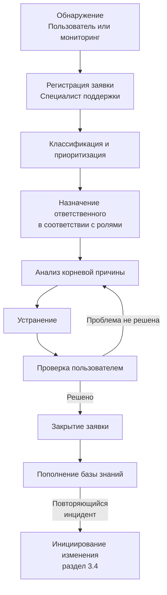
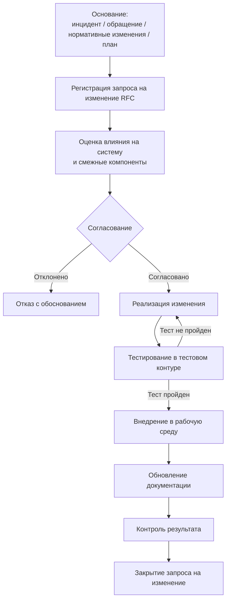

# Теория

## Этап 3. Анализ инцидентов, обращений и управление изменениями

> Внимание! Все схемы в примере являются схематичными, требуется учитывать нотации при создании отчёта.

---

### 3.1. Инцидент как единица анализа сопровождения

**Инцидент** — любое незапланированное событие, которое нарушает или может нарушить нормальную работу информационной системы. Инцидент не всегда означает, что система полностью не работает — достаточно, чтобы один или несколько пользователей не могли выполнить свои задачи в штатном режиме.

Анализ инцидентов — это не просто перечисление того, «что сломалось». Это **структурированное описание**: что произошло, почему, какие последствия, кто ответственен и как проблема была решена. Именно такая структура позволяет в дальнейшем выявлять паттерны и переходить от реактивного устранения к проактивному предотвращению.

---

### 3.2. Классификация обращений пользователей

#### 3.2.1. Два класса обращений

Все обращения пользователей делятся на два принципиально разных класса.

**Инцидентные обращения** — система функционирует с нарушением:

* ошибки при входе в систему или аутентификации;
* невозможность сохранить или отредактировать запись;
* недоступность отдельных функций или модулей;
* ошибки прав доступа (доступ закрыт или, наоборот, открыт лишнее);
* ошибки в вычислениях или отображении данных;
* снижение производительности (система «тормозит»);
* полная недоступность системы.

**Сервисные обращения** — система работает штатно, нужна помощь или доработка:

* вопросы по работе с системой («как сделать X?»);
* запрос на расширение функционала («нужна новая кнопка»);
* запрос на изменение справочника или настройки;
* запрос на новый отчёт или форму;
* запрос на обучение.

> Разделение на классы принципиально: **инцидентные обращения** обрабатываются по регламенту SLA (Этап 2), **сервисные** — через процедуру управления изменениями (раздел 3.4). Смешение классов приводит к срыву SLA или необоснованным ожиданиям.

#### 3.2.2. Характеристика типовых инцидентов

| Инцидент | Возможная причина | Последствия | Критичность | Ответственный |
|----------|------------------|-------------|:-----------:|---------------|
| Пользователь не может войти в систему | Ошибка пароля, блокировка учётной записи, сбой аутентификации | Простой пользователя | Средняя | Специалист поддержки |
| Ошибка при сохранении записи | Сбой БД, ошибка валидации формы, потеря соединения | Потеря данных / повторный ввод | Высокая | Специалист сопровождения |
| Недоступность системы | Отказ сервера, ошибка обновления, сетевой сбой | Остановка работы всего подразделения | Критическая | Системный администратор |
| Ошибки прав доступа | Неверная настройка ролей, ошибка при заведении пользователя | Риск утечки данных или блокировки работы | Высокая | Системный администратор |
| Снижение производительности | Перегрузка БД, рост объёма данных, утечка памяти | Замедление работы сотрудников | Средняя | Администратор / Специалист сопровождения |
| Некорректные данные в отчёте | Ошибка в логике расчёта, проблема с выборкой | Неверные управленческие решения | Высокая | Специалист сопровождения |
| Ошибка интеграции с внешней системой | Изменение API, ошибка маппинга | Двойной ввод данных, рассинхронизация | Высокая | Специалист сопровождения |

---

### 3.3. Жизненный цикл обработки инцидента

Жизненный цикл инцидента — стандартизированный путь от момента обнаружения до окончательного закрытия. Каждый шаг цикла выполняется участниками, роли которых определены в Этапе 2.

#### 3.3.1. Шаги жизненного цикла

1. **Обнаружение** — пользователь или система мониторинга фиксирует нарушение.
2. **Регистрация** — специалист поддержки заводит заявку с описанием симптомов, категорией и приоритетом.
3. **Классификация и приоритизация** — определяются тип инцидента и критичность по таблице из раздела 3.2.2.
4. **Назначение ответственного** — заявка направляется соответствующей линии поддержки.
5. **Анализ причины** — специалист определяет корневую причину (root cause), а не только симптом.
6. **Устранение** — выполняются действия по восстановлению нормальной работы.
7. **Проверка** — пользователь подтверждает, что проблема устранена.
8. **Закрытие заявки** — заявка помечается как решённая; фиксируется применённое решение.
9. **Пополнение базы знаний** — решение сохраняется для ускорения обработки аналогичных инцидентов.

#### 3.3.2. Схема жизненного цикла

///caption
Рисунок 1 – Жизненный цикл обработки инцидента
///

**Пояснение к рисунку 1:**

* цикл «анализ → устранение → проверка» может повторяться, если первая попытка устранения не дала результата;
* пополнение базы знаний после закрытия — обязательный шаг: именно так формируется системное знание службы сопровождения;
* переход к инициированию изменения происходит, когда инцидент повторяется или требует доработки системы, а не просто оперативного исправления.

#### 3.3.3. Принцип корневой причины

Устранение симптома без анализа причины — временное решение. Если пользователь не может войти в систему и специалист просто разблокировал учётную запись — проблема решена. Но если это происходит регулярно — нужно выяснить, почему блокировки происходят, и устранить причину.

**Типовые категории корневых причин:**

| Категория | Примеры |
|-----------|---------|
| Программные ошибки | Баг в логике, ошибка обработки исключений |
| Конфигурационные проблемы | Неверные настройки прав, параметров соединения |
| Инфраструктурные | Нехватка ресурсов сервера, сетевые проблемы |
| Проблемы данных | Некорректные записи в БД, конфликт ключей |
| Ошибки пользователей | Неверный ввод, непонимание процесса работы |
| Внешние зависимости | Изменение API партнёра, сбой стороннего сервиса |

---

### 3.4. Управление изменениями

#### 3.4.1. Связь инцидентов с изменениями

Изменения в системе возникают **не произвольно**, а как следствие:

* накопленных инцидентов одного типа (системная проблема, требующая доработки);
* сервисных обращений (запросы на новый функционал или настройку);
* изменений нормативных требований (адаптивное сопровождение);
* планового совершенствования (по результатам анализа метрик).

Эта причинно-следственная связь должна быть явно зафиксирована: каждый запрос на изменение должен ссылаться на основание.

#### 3.4.2. Виды изменений

| Вид изменения | Основание для инициирования | Пример |
|---------------|----------------------------|--------|
| **Корректирующее** | Устранение выявленного дефекта или ошибки | Исправление некорректного расчёта в отчёте |
| **Адаптивное** | Изменение нормативных требований или внешней среды | Новый формат выгрузки по требованию регулятора |
| **Совершенствующее** | Улучшение функционала по запросу пользователей | Добавление фильтра в список документов |
| **Профилактическое** | Предупреждение потенциальных отказов | Оптимизация запросов при росте объёма данных |

#### 3.4.3. Порядок управления изменением

Контролируемое внесение изменений — ключевой принцип: **неконтролируемое изменение — источник новых инцидентов**.

1. **Инициирование** — фиксируется основание: инцидент (с номером заявки), обращение, план или нормативное требование.
2. **Регистрация запроса на изменение (RFC)** — описываются суть, объём, цель и ожидаемый результат.
3. **Оценка влияния** — анализируются риски: что может сломаться при внедрении изменения.
4. **Согласование** — изменение утверждается руководителем сопровождения; при высоком риске — согласуется с руководством организации.
5. **Реализация** — выполняется специалистом сопровождения или разработчиком.
6. **Тестирование** — обязательная проверка в тестовом контуре; без тестирования внедрение запрещено.
7. **Внедрение в рабочую среду** — установка изменения в production; желательно в период минимальной нагрузки.
8. **Обновление документации** — пользовательские инструкции, технические описания, регламенты актуализируются.
9. **Контроль результата** — подтверждается корректность изменения; закрывается исходная заявка.

///caption
Рисунок 2 – Процесс управления изменениями
///

**Пояснение к рисунку 2:**

* изменение может быть отклонено на этапе согласования — это нормальная ситуация, если оценка влияния выявила неприемлемые риски;
* тестирование — обязательный барьер перед внедрением; возврат к реализации при отрицательных результатах не является сбоем процесса;
* обновление документации завершает цикл: изменение считается внедрённым только тогда, когда пользователи знают, как работать с новым поведением системы.

---

### 3.5. База знаний службы сопровождения

**База знаний** — структурированная коллекция описаний инцидентов и их решений. Она служит нескольким целям:

* **Ускорение решения** — специалист 1-й линии может решить проблему самостоятельно, не прибегая к эскалации.
* **Снижение зависимости от конкретного специалиста** — знание остаётся в организации, а не уходит с сотрудником.
* **Аналитика** — база позволяет видеть, какие проблемы повторяются, и инициировать изменения.

Минимальная структура записи в базе знаний:

| Поле | Содержание |
|------|-----------|
| Симптом | Как проявляется проблема (что видит пользователь) |
| Корневая причина | Почему это происходит |
| Решение | Шаги устранения |
| Проверка | Как убедиться, что проблема решена |
| Категория | Тип инцидента |
| Дата добавления | Когда зафиксировано |

---

### 3.6. Результат этапа

По итогам Этапа 3 должно быть зафиксировано:

1. **Классификация обращений** — разграничение инцидентных и сервисных обращений с примерами.
2. **Характеристика типовых инцидентов** — таблица с причинами, последствиями, критичностью и ответственными.
3. **Жизненный цикл инцидента** — схема и описание шагов от обнаружения до закрытия.
4. **Виды изменений** — корректирующие, адаптивные, совершенствующие, профилактические.
5. **Процедура управления изменениями** — схема и описание шагов от инициирования до контроля результата.

Накопленная база инцидентов и зафиксированные изменения становятся **основными источниками данных** для оценки качества сопровождения в Этапе 4.
