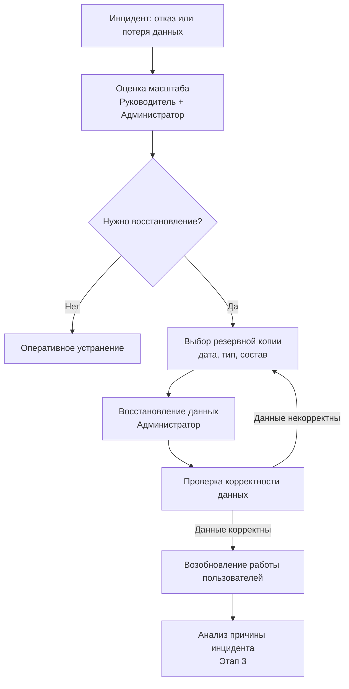

# Теория

## Этап 4. Обеспечение непрерывности и контроль качества сопровождения

> Внимание! Все схемы в примере являются схематичными, требуется учитывать нотации при создании отчёта.

---

### 4.1. Логика этапа

Если Этапы 2 и 3 описывали **реактивную** сторону сопровождения (как реагировать на проблемы), то Этап 4 охватывает **проактивный уровень**: как не допустить потери данных, как вовремя заметить деградацию системы и как оценить, насколько хорошо работает служба сопровождения.

Три направления этапа взаимосвязаны:

///caption
Рисунок 1 – Взаимосвязь направлений Этапа 4
///

---

### 4.2. Резервное копирование и восстановление

#### 4.2.1. Назначение резервного копирования

**Резервное копирование** — создание копий данных и компонентов системы, пригодных для восстановления в случае инцидента. Это не страховка от всех проблем, а гарантия того, что при наихудшем сценарии потеря данных будет ограниченной и предсказуемой.

Два ключевых показателя определяют политику резервного копирования:

* **RPO (Recovery Point Objective)** — допустимое окно потери данных. Если RPO = 24 часа, значит, при отказе допустимо потерять не более 24 часов работы.
* **RTO (Recovery Time Objective)** — допустимое время восстановления. Если RTO = 4 часа, значит, система должна быть восстановлена не позднее чем через 4 часа после отказа.

Чем меньше RPO и RTO — тем выше стоимость инфраструктуры и тем жёстче должен быть регламент.

#### 4.2.2. Объекты резервного копирования

| Объект | Типичная периодичность | Место хранения | Ответственный |
|--------|:---------------------:|----------------|:-------------:|
| База данных (полная копия) | Ежедневно | Резервный сервер / облако | Системный администратор |
| Инкрементальные копии БД | Несколько раз в день | Резервный сервер | Системный администратор |
| Файлы системы и дистрибутив | Еженедельно | Резервное хранилище | Системный администратор |
| Пользовательские файлы / вложения | Ежедневно | Отдельное хранилище | Системный администратор |
| Конфигурационные файлы | При каждом изменении | Защищённый архив / VCS | Администратор |
| Журналы системы (логи) | По расписанию | Архивное хранилище | Администратор |

#### 4.2.3. Порядок восстановления

Процедура восстановления должна быть задокументирована **заранее** — в момент инцидента на анализ нет времени.

Необходимо определить:

* **Триггеры восстановления** — при каких ситуациях запускается процедура (полный отказ, частичная потеря данных, ошибочное изменение);
* **Источник восстановления** — из какой резервной копии (полная, инкрементальная) и за какой период выполняется восстановление;
* **Ответственные** — кто принимает решение о начале восстановления и кто технически его выполняет;
* **Проверка** — как подтверждается корректность восстановленных данных перед возобновлением работы пользователей.

///caption
Рисунок 2 – Процедура восстановления после инцидента
///

---

### 4.3. Журналирование и мониторинг

#### 4.3.1. Разница между мониторингом и журналированием

* **Журналирование (logging)** — запись событий, происходящих в системе. Это исторические данные: кто, когда, что сделал; какие ошибки возникли.
* **Мониторинг** — непрерывное наблюдение за состоянием системы в реальном времени. Это текущие данные: система работает или нет; нагрузка растёт или нет.

Оба инструмента взаимодополняют друг друга: **мониторинг обнаруживает проблему**, **журналы помогают её расследовать**.

#### 4.3.2. Что подлежит журналированию

| Категория событий | Примеры | Зачем хранить |
|-------------------|---------|---------------|
| Аутентификация | Входы, выходы, неудачные попытки входа | Безопасность; расследование инцидентов |
| Действия с данными | Создание, изменение, удаление записей | Аудит; восстановление после ошибочных изменений |
| Системные ошибки | Необработанные исключения, ошибки БД | Диагностика инцидентов |
| Административные действия | Изменения прав, настройки системы | Контроль изменений конфигурации |
| Интеграционные события | Обмены с внешними системами, ошибки интеграции | Диагностика проблем стыков |
| Производительность | Медленные запросы, тайм-ауты | Профилактика деградации |

#### 4.3.3. Параметры мониторинга

| Параметр | Что отслеживается | Порог тревоги |
|----------|-------------------|:-------------:|
| Доступность системы | Система отвечает на запросы? | < 99% за период |
| Время отклика | Среднее время ответа страницы / API | > 3 секунды |
| Нагрузка на CPU / RAM | Загрузка процессора и памяти сервера | > 80% |
| Место на диске | Свободное пространство на серверах | < 20% |
| Нагрузка на БД | Количество запросов, блокировки | Аномальный рост |
| Очередь задач | Накопленные фоновые задачи | Стагнация очереди |

#### 4.3.4. Оповещение и реагирование

При превышении порогов система мониторинга должна автоматически уведомить ответственных. Необходимо определить:

* **Кто получает оповещение** — по каждому параметру назначается ответственный;
* **Канал оповещения** — email, SMS, мессенджер, тикет в helpdesk;
* **Время реакции** — в какие сроки ответственный должен отреагировать.

---

### 4.4. Метрики качества сопровождения

#### 4.4.1. Назначение метрик

**Метрики** — измеримые показатели, позволяющие объективно оценить эффективность работы службы сопровождения. Без метрик невозможно понять, улучшается ли ситуация или нет: ощущения специалистов субъективны, а цифры — нет.

Исходными данными для расчёта метрик служат журналы заявок, данные мониторинга и журналы системы, накопленные в Этапах 2–4.

#### 4.4.2. Ключевые метрики

| Метрика | Что измеряется | Единица | Хороший показатель |
|---------|---------------|---------|:-----------------:|
| **Среднее время реакции (MTTR)** | От регистрации заявки до начала работы специалиста | мин / ч | Ниже порога SLA |
| **Среднее время устранения (MTRS)** | От начала работы до полного решения инцидента | ч / дни | Ниже порога SLA |
| **Доступность системы (Uptime)** | Доля времени штатной работы за период | % | ≥ 99% |
| **Уровень повторных инцидентов** | Инциденты, возникшие повторно по той же причине | % | < 10% |
| **Процент просроченных заявок** | Обращения, не закрытые в срок по SLA | % | < 5% |
| **Процент решённых без эскалации** | Заявки, решённые на 1-й линии | % | > 70% |
| **Среднее число инцидентов в период** | Общий объём инцидентов за месяц/квартал | шт | Снижение со временем |
| **Удовлетворённость пользователей** | Оценка качества решения по обратной связи | балл | ≥ 4 из 5 |

#### 4.4.3. Интерпретация метрик

Метрики не используются изолированно — каждый показатель указывает на конкретную проблему или достижение:

| Симптом | Возможная причина | Рекомендуемое действие |
|---------|-------------------|----------------------|
| Высокий уровень повторных инцидентов | Проблемы устраняются без анализа причины | Внедрить обязательный анализ корневой причины |
| Много просроченных заявок | Ресурсы службы не соответствуют нагрузке | Пересмотреть штат или SLA |
| Низкий Uptime | Недостаточная инфраструктура или частые обновления со сбоями | Улучшить процедуру обновления; усилить мониторинг |
| Низкий процент решённых без эскалации | 1-я линия слабо обучена | Создать / пополнить базу знаний; провести обучение |
| Снижение удовлетворённости | Долгое время решения или формальный подход | Пересмотреть коммуникацию с пользователями |

---

### 4.5. Предложения по совершенствованию

#### 4.5.1. Принцип обоснованности

Каждое предложение по совершенствованию должно быть **обосновано выявленной проблемой**: значением метрики, паттерном инцидентов или конкретным недостатком процесса. Предложения «в воздух» не несут ценности.

Структура предложения:

* **Выявленная проблема** — что именно не работает или работает плохо;
* **Предлагаемая мера** — конкретное действие;
* **Ожидаемый эффект** — как изменится метрика или процесс.

#### 4.5.2. Типовые меры по совершенствованию

| Выявленная проблема | Предлагаемая мера |
|--------------------|-------------------|
| Нет единой точки регистрации обращений | Внедрить helpdesk-систему с обязательной регистрацией всех каналов |
| Высокий уровень повторных обращений | Создать базу знаний по типовым инцидентам |
| Отсутствует задокументированный SLA | Формализовать и согласовать SLA с руководством |
| Сбои обнаруживаются пользователями, а не службой | Внедрить автоматический мониторинг доступности с оповещениями |
| Инциденты после обновлений | Ввести тестовый контур и обязательное тестирование перед внедрением |
| Резервное копирование выполняется вручную | Настроить автоматическое резервное копирование по расписанию |
| Повторяющиеся проблемы с правами доступа | Разработать и формализовать матрицу ролей и прав |
| Долгое время устранения сложных инцидентов | Создать процедуру эскалации с чёткими критериями и временными рамками |

---

### 4.6. Результат этапа

По итогам Этапа 4 должно быть зафиксировано:

1. **Политика резервного копирования** — объекты, периодичность, хранение, ответственные.
2. **Процедура восстановления** — триггеры, источник, ответственные, проверка.
3. **Журналирование** — какие события фиксируются и для каких целей.
4. **Мониторинг** — какие параметры отслеживаются, пороги тревоги, оповещение.
5. **Метрики качества** — перечень метрик, единицы измерения, эталонные значения.
6. **Предложения по совершенствованию** — конкретные меры, обоснованные выявленными проблемами.

Вместе с результатами Этапов 1–3 это формирует **полную систему сопровождения**: от понимания объекта и организации службы — до проактивного обеспечения качества и непрерывности.
